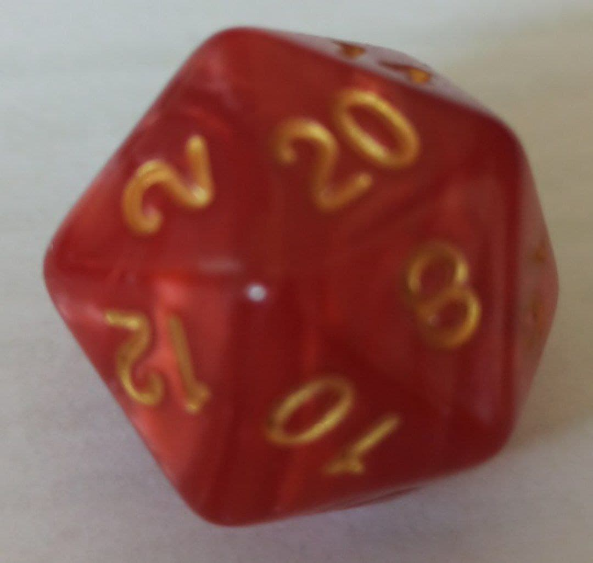
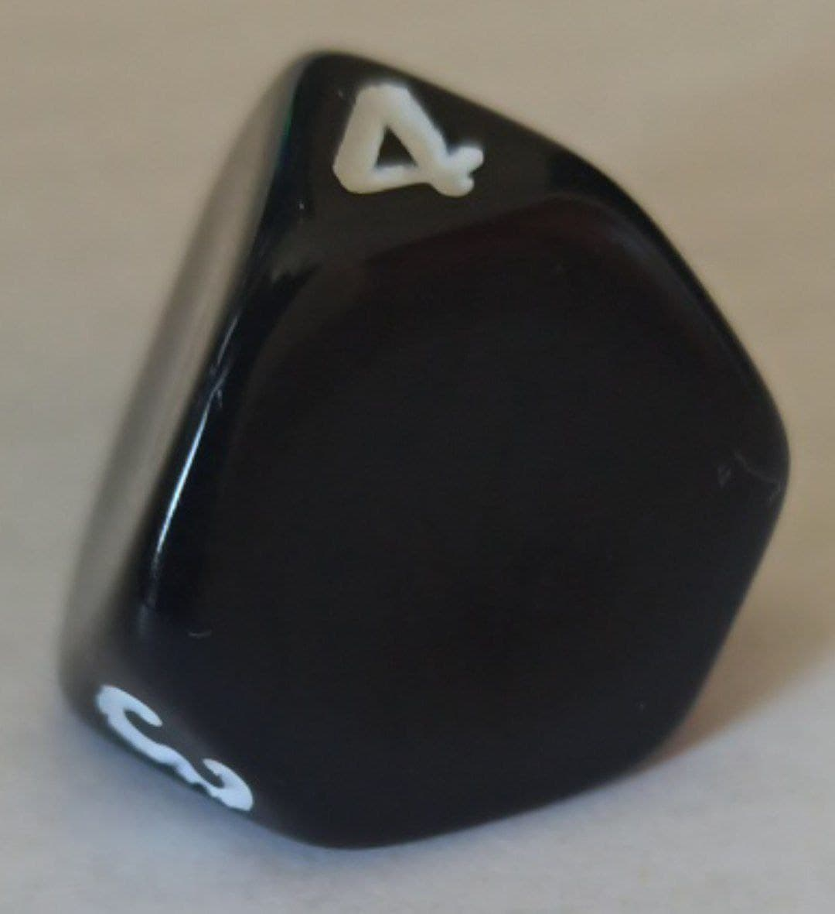

# Dados

- [Galego](doc/dados.md#índice)
- [English](doc/dados.md#index)

## Índice
- [Dado 1](doc/datos.md#dado-1)
- [Dado 2](doc/datos.md#dado-2)

### Dado 1

| Atributo  | Información   |
|:--------: |:-----------:  |
|   Tipo    |  Icosahedro   |
|   Caras   |      20       |

Sistema Vixesimal usado:
|  Decimal      | 1     | 2     | 3     | 4     | 5     | 6     | 7     | 8     | 9     | 10    | 11    | 12    | 13    | 14    | 15    | 16    | 17    | 18    | 19    | 20    |
|:---------:    |:-:    |:-:    |:-:    |:-:    |:-:    |:-:    |:-:    |:-:    |:-:    |:--:   |:--:   |:--:   |:--:   |:--:   |:--:   |:--:   |:--:   |:--:   |:--:   |:--:   |
| Vixesimal     | 1     | 2     | 3     | 4     | 5     | 6     | 7     | 8     | 9     |  A    |  B    |  C    |  D    |  E    |  F    |  G    |  H    |  K    |  M    |  0    |

### Dado 2

| Atributo  | Información                              |
|:--------: |:-----------:                             |
|   Tipo    |  Pirámide triangular de puntas truncadas |
|   Caras   |      4                                   |

Sistema cuaternario usado:
|  Decimal      | 1     | 2     | 3     | 4     |
|:---------:    |:-:    |:-:    |:-:    |:-:    |
| Cuaternario   | 1     | 2     | 3     | 0     |

## Index
- [Dice 1](doc/datos.md#dice-1)
- [Dice 2](doc/datos.md#dice-2)

### Dice 1

| Feature   | Information   |
|:--------: |:-----------:  |
|   Type    |  Icosahedro   |
|   Sides   |      20       |

Vigesimal system used:
|  Denary       | 1     | 2     | 3     | 4     | 5     | 6     | 7     | 8     | 9     | 10    | 11    | 12    | 13    | 14    | 15    | 16    | 17    | 18    | 19    | 20    |
|:---------:    |:-:    |:-:    |:-:    |:-:    |:-:    |:-:    |:-:    |:-:    |:-:    |:--:   |:--:   |:--:   |:--:   |:--:   |:--:   |:--:   |:--:   |:--:   |:--:   |:--:   |
| Vigesimal     | 1     | 2     | 3     | 4     | 5     | 6     | 7     | 8     | 9     |  A    |  B    |  C    |  D    |  E    |  F    |  G    |  H    |  K    |  M    |  0    |

### Dice 2

| Feature   | Information                              |
|:--------: |:-----------:                             |
|   Type    |  Triangular pyramid with cutted tips     |
|   Sides   |      4                                   |

Sistema cuaternario usado:
|  Denary      | 1     | 2     | 3     | 4     |
|:---------:   |:-:    |:-:    |:-:    |:-:    |
| Quaternary   | 1     | 2     | 3     | 0     |
