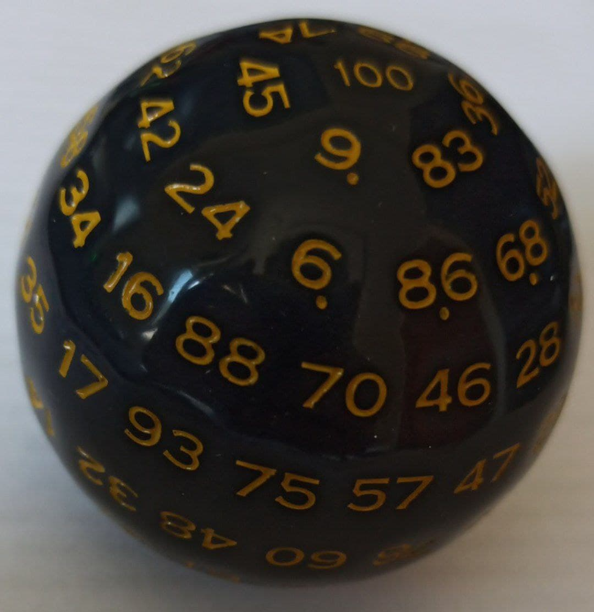

[🏠](README.md)
- [Galego](dados.md#índice)
- [English](dados.md#index)

# Dados
## Índice
- [Dado 1: Icosahedro](dados.md#dado-1)
- [Dado 2: Tetrahedro truncado](dados.md#dado-2)
- [Dado 3: Hectaedro](dados.md#dado-3)

### Dado 1
[dado-1.txt](../src/dados/dado-1.txt)  
  

| Atributo  | Información   |
|:--------: |:-----------:  |
|   Tipo    |  Icosahedro   |
|   Caras   |      20       |

Sistema Vixesimal usado:
|  Decimal      | 1     | 2     | 3     | 4     | 5     | 6     | 7     | 8     | 9     | 10    | 11    | 12    | 13    | 14    | 15    | 16    | 17    | 18    | 19    | 20    |
|:---------:    |:-:    |:-:    |:-:    |:-:    |:-:    |:-:    |:-:    |:-:    |:-:    |:--:   |:--:   |:--:   |:--:   |:--:   |:--:   |:--:   |:--:   |:--:   |:--:   |:--:   |
| Vixesimal     | 1     | 2     | 3     | 4     | 5     | 6     | 7     | 8     | 9     |  A    |  B    |  C    |  D    |  E    |  F    |  G    |  H    |  K    |  M    |  0    |

### Dado 2
[dado-2.txt](../src/dados/dado-2.txt)  

| Atributo  | Información            |
|:--------: |:-----------:           |
|   Tipo    |  Tetrahedro Truncado   |
|   Caras   |      4                 |

Sistema cuaternario usado:
|  Decimal      | 1     | 2     | 3     | 4     |
|:---------:    |:-:    |:-:    |:-:    |:-:    |
| Cuaternario   | 1     | 2     | 3     | 0     |

### Dado 3
[dado-3.txt](../src/dados/dado-3.txt)  

| Atributo  | Información     |
|:--------: |:-----------:    |
|   Tipo    |  Hecotahedro    |
|   Caras   |      100        |

Sistema centesimal usado:
|            |     |     |      |      |      |      |      |      |     |      |     |      |     |      |      |     |      |     |      |
|:----------:|:---:|:---:|:----:|:----:|:----:|:----:|:----:|:----:|:---:|:----:|:---:|:----:|:---:|:----:|:----:|:---:|:----:|:---:|:----:|
|   Decimal  |  1  |  2  |   3  |   4  |   5  |   6  |   7  |   8  |  9  |  10  |  11 |  12  |  13 |  14  |  15  |  16 |  17  |  18 |  19  |
| Centesimal |  1  |  2  |   3  |   4  |   5  |   6  |   7  |   8  |  9  |   A  |  B  |   C  |  D  |   E  |   F  |  G  |   H  |  K  |   M  |
|  Alt-Code  |  49 |  50 |  51  |  52  |  53  |  54  |  55  |  56  |  57 |  65  |  66 |  67  |  68 |  69  |  70  |  71 |  72  |  75 |  77  |
|   Decimal  |  20 |  21 |  22  |  23  |  24  |  25  |  26  |  27  |  28 |  29  |  30 |  31  |  32 |  33  |  34  |  35 |  36  |  37 |  38  |
| Centesimal |  N  |  P  |   R  |   S  |   T  |   V  |   W  |   X  |  Y  |   Z  |  ,  |   „  |  ;  |   .  |   :  |  -  |   _  |  +  |   *  |
|  Alt-Code  |  78 |  80 |  82  |  83  |  84  |  86  |  87  |  88  |  89 |  90  |  44 | 0132 |  59 |  46  |  58  |  45 |  95  |  43 |  42  |
|   Decimal  |  39 |  40 |  41  |  42  |  43  |  44  |  45  |  46  |  47 |  48  |  49 |  50  |  51 |  52  |  53  |  54 |  55  |  56 |  57  |
| Centesimal |  =  |  ÷  |   ƒ  |   Ø  |   (  |   )  |   ¡  |   !  |  ‼  |   ¿  |  ?  |   '  |  "  |   «  |   »  |  ⌐  |   ¬  |  ^  |   ~  |
|  Alt-Code  |  61 | 246 | 0131 | 0216 |  40  |  41  | 0161 |  33  |  19 |  168 |  63 |  39  |  34 | 0171 | 0187 | 169 | 0172 |  94 |  126 |
|   Decimal  |  58 |  59 |  60  |  61  |  62  |  63  |  64  |  65  |  66 |  67  |  68 |  69  |  70 |  71  |  72  |  73 |  74  |  75 |  76  |
| Centesimal |  &  |  $  |   €  |   £  |   ¥  |   ¢  |   @  |   #  |  %  |   ‰  |  ∞  |   ß  |  Γ  |   π  |   Σ  |  µ  |   τ  |  φ  |   Ω  |
|  Alt-Code  |  38 |  36 | 0128 | 0163 | 0165 | 0162 |  64  |  35  |  37 | 0137 | 236 |  225 | 226 |  227 |  228 | 230 |  231 | 232 |  234 |
|   Decimal  |  77 |  78 |  79  |  80  |  81  |  82  |  83  |  84  |  85 |  86  |  87 |  88  |  89 |  90  |  91  |  92 |  93  |  94 |  95  |
| Centesimal |  δ  |  ε  |   ∩  |   █  |   ▲  |   ■  |  \|  |   §  |  þ  |   ☻  |  ♥  |   ♦  |  ♣  |   ♠  |   ¶  |  ♪  |   ♫  |  ○  |   •  |
|  Alt-Code  | 235 | 238 |  239 |  219 |  30  |  254 |  124 | 0167 | 254 |   2  |  3  |   4  |  5  |   6  |  20  |  13 |  14  |  9  | 0149 |
|   Decimal  |  96 |  97 |  98  |  99  |  100 |      |      |      |     |      |     |      |     |      |      |     |      |     |      |
| Centesimal |  ⌂  |  ♂  |   ♀  |   ↔  |   0  |      |      |      |     |      |     |      |     |      |      |     |      |     |      |
|  Alt-Code  | 127 |  11 |  12  |  29  |  48  |      |      |      |     |      |     |      |     |      |      |     |      |     |      |

# Dice
## Index
- [Dice 1: Icosahedron](dados.md#dice-1)
- [Dice 2: Truncated Tetrahedron](dados.md#dice-2)
- [Dice 2: Hecotahedron](dados.md#dice-3)

### Dice 1
[dice-1.txt](../src/dados/dado-1.txt)  

| Feature   | Information   |
|:--------: |:-----------:  |
|   Type    |  Icosahedro   |
|   Sides   |      20       |

Vigesimal system used:
|  Denary       | 1     | 2     | 3     | 4     | 5     | 6     | 7     | 8     | 9     | 10    | 11    | 12    | 13    | 14    | 15    | 16    | 17    | 18    | 19    | 20    |
|:---------:    |:-:    |:-:    |:-:    |:-:    |:-:    |:-:    |:-:    |:-:    |:-:    |:--:   |:--:   |:--:   |:--:   |:--:   |:--:   |:--:   |:--:   |:--:   |:--:   |:--:   |
| Vigesimal     | 1     | 2     | 3     | 4     | 5     | 6     | 7     | 8     | 9     |  A    |  B    |  C    |  D    |  E    |  F    |  G    |  H    |  K    |  M    |  0    |

### Dice 2
[dice-2.txt](../src/dados/dado-2.txt)  

| Feature   | Information                |
|:--------: |:-----------:               |
|   Type    |  Truncated Tetrahedron     |
|   Sides   |      4                     |

Sistema cuaternario usado:
|  Denary      | 1     | 2     | 3     | 4     |
|:---------:   |:-:    |:-:    |:-:    |:-:    |
| Quaternary   | 1     | 2     | 3     | 0     |

### Dice 3
[dice-3.txt](../src/dados/dado-3.txt)  

| Feature   | Information       |
|:--------: |:-----------:      |
|   Type    |  Hecotahedron     |
|   Sides   |      100          |

Sistema centesimal usado:
|            |    |    |    |    |     |    |    |    |    |    |    |    |    |    |    |    |    |    |    |
|:----------:|:--:|:--:|:--:|:--:|:---:|:--:|:--:|:--:|:--:|:--:|:--:|:--:|:--:|:--:|:--:|:--:|:--:|:--:|:--:|
|   Denary   |  1 |  2 |  3 |  4 |  5  |  6 |  7 |  8 |  9 | 10 | 11 | 12 | 13 | 14 | 15 | 16 | 17 | 18 | 19 |
| Centesimal |  1 |  2 |  3 |  4 |  5  |  6 |  7 |  8 |  9 |  A |  B |  C |  D |  E |  F |  G |  H |  K |  M |
|   Denary   | 20 | 21 | 22 | 23 |  24 | 25 | 26 | 27 | 28 | 29 | 30 | 31 | 32 | 33 | 34 | 35 | 36 | 37 | 38 |
| Centesimal |  N |  P |  R |  S |  T  |  V |  W |  X |  Y |  Z |  , |  „ |  ; |  . |  : |  - |  _ |  + |  * |
|   Denary   | 39 | 40 | 41 | 42 |  43 | 44 | 45 | 46 | 47 | 48 | 49 | 50 | 51 | 52 | 53 | 54 | 55 | 56 | 57 |
| Centesimal |  = |  ÷ |  ƒ |  Ø |  (  |  ) |  ¡ |  ! |  ‼ |  ¿ |  ? |  ' |  " |  « |  » |  ⌐ |  ¬ |  ^ |  ~ |
|   Denary   | 58 | 59 | 60 | 61 |  62 | 63 | 64 | 65 | 66 | 67 | 68 | 69 | 70 | 71 | 72 | 73 | 74 | 75 | 76 |
| Centesimal |  & |  $ |  € |  £ |  ¥  |  ¢ |  @ |  # |  % |  ‰ |  ∞ |  ß |  Γ |  π |  Σ |  µ |  τ |  φ |  Ω |
|   Denary   | 77 | 78 | 79 | 80 |  81 | 82 | 83 | 84 | 85 | 86 | 87 | 88 | 89 | 90 | 91 | 92 | 93 | 94 | 95 |
| Centesimal |  δ |  ε |  ∩ |  █ |  ▲  |  ■ | \| |  § |  þ |  ☻ |  ♥ |  ♦ |  ♣ |  ♠ |  ¶ |  ♪ |  ♫ |  ○ |  • |
|   Denary   | 96 | 97 | 98 | 99 | 100 |    |    |    |    |    |    |    |    |    |    |    |    |    |    |
| Centesimal |  ⌂ |  ♂ |  ♀ |  ↔ |  0  |    |    |    |    |    |    |    |    |    |    |    |    |    |    |
