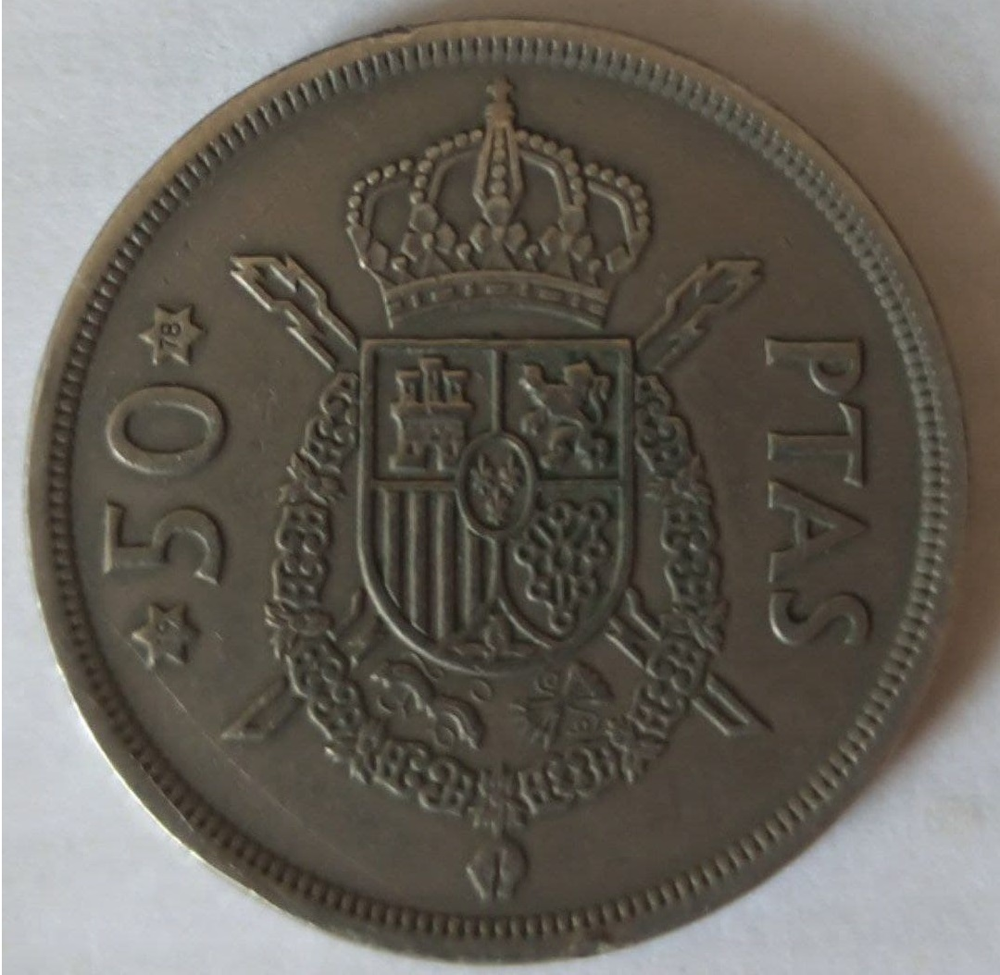

[🏠](../README.md)

- [Galego](dados.md#índice)
- [English](dados.md#index)

# Moedas
## Índice
- [Moeda 1](moedas.md#moeda-1)

# Moeda 1
[moeda-1.txt](../src/moedas/moeda-1.txt)  
 

|   Atributo    |      Información      |
|:-----------:  |:--------------------: |
|    Moeda      | 50 pesetas 1975-1978  |
|    Estado     |       Hespanha        |
| Composición   | Cobre/Níquel (Cu/Ni)  |
|    Canto      |        Gravado        |
|    Forma      |        Redonda        |
| Alinhamento   |     Moeda (180º)      |
|     Peso      |        12.4 gr        |
|   Diámetro    |         30 mm         |
|    Grosor     |        2.3 mm         |

[Info in ucoin.net (en)](https://en.ucoin.net/coin/spain-50-pesetas-1975/?tid=9331)  
[Info en ucoin.net (cas)](https://es.ucoin.net/coin/spain-50-pesetas-1975/?tid=9331)

# Coins
## Index
- [Coin 1](moedas.md#coin-1)

# Coin 1
[coin-1.txt](../src/moedas/moeda-1.txt)  
 

|   Atributo    |      Información      |
|:-----------:  |:--------------------: |
|    Moeda      | 50 pesetas 1975-1978  |
|    Estado     |       Hespanha        |
| Composición   | Cobre/Níquel (Cu/Ni)  |
|    Canto      |        Gravado        |
|    Forma      |        Redonda        |
| Alinhamento   |     Moeda (180º)      |
|     Peso      |        12.4 gr        |
|   Diámetro    |         30 mm         |
|    Grosor     |        2.3 mm         |

[Info in ucoin.net (en)](https://en.ucoin.net/coin/spain-50-pesetas-1975/?tid=9331)  
[Info en ucoin.net (cas)](https://es.ucoin.net/coin/spain-50-pesetas-1975/?tid=9331)
